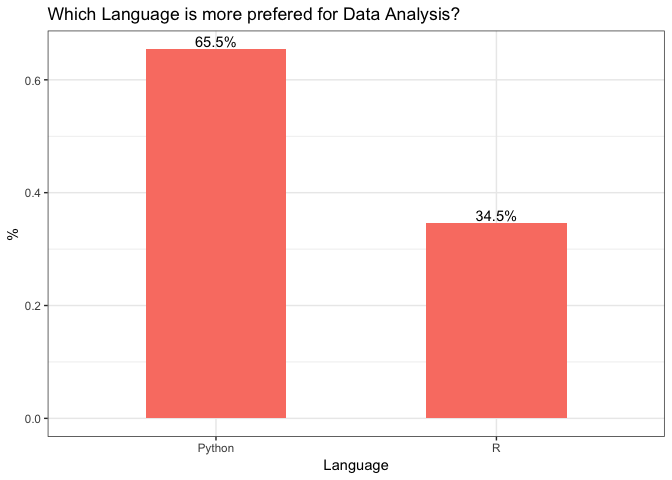
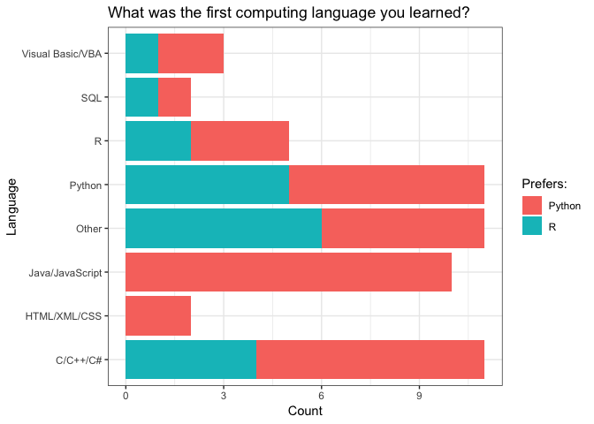
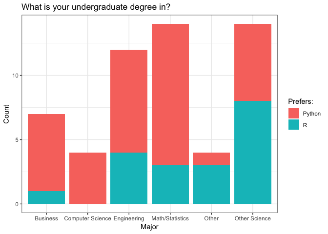
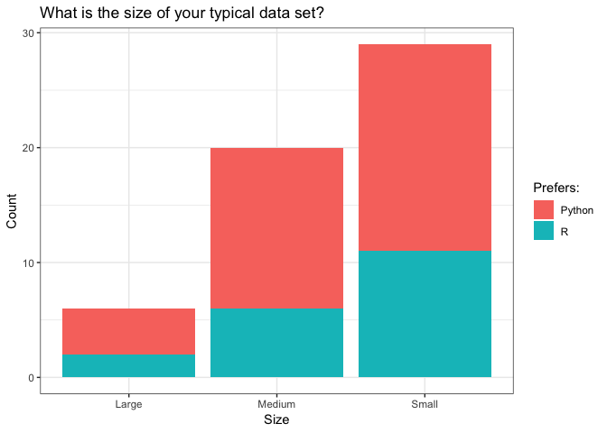
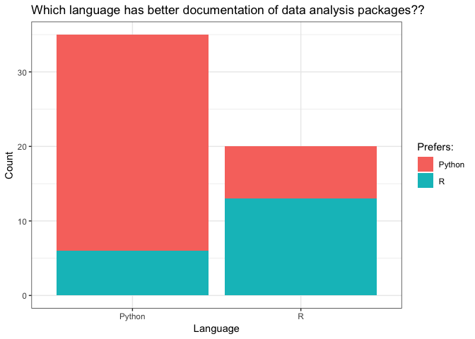

Exploratory Data Analysis (EDA)
================

## Team Members

  - Brenden Everitt
  - Miliban Keyim  
  - Maninder Kohli
  - Phuntsok Tseten

## Survey Questions Being Explored

  - Q1 What is your preffered language to use when doing data analysis?
  - Q2 What is the first computing language you learned?
  - Q3 What was your undergraduate degree in?
  - Q4 What is the typical size of your analysis projects? Small(10K
    rows), Medium(10-1M rows), or large (1m+ rows)?
  - Q5 Which language do you think has better documentation when it
    comes to its data analysis packages?

## Exploratory Data Analysis (EDA)

Importing Data and Data Wrangling

## Analyzing Summary Data

Summary of all survey data

``` r
survey_summary <- summary(survey)
survey_summary
```

    ##       Q1                    Q2                    Q3          Q4    
    ##  Python:36   C/C++/C#        :11   Business        : 7   Large : 6  
    ##  R     :19   Other           :11   Computer Science: 4   Medium:20  
    ##              Python          :11   Engineering     :12   Small :29  
    ##              Java/JavaScript :10   Math/Statistics :14              
    ##              R               : 5   Other           : 4              
    ##              Visual Basic/VBA: 3   Other Science   :14              
    ##              (Other)         : 4                                    
    ##       Q5    
    ##  Python:35  
    ##  R     :20  
    ##             
    ##             
    ##             
    ##             
    ## 

Q1 What is your preffered language to use when doing data analysis?

``` r
q1 <- table(survey$Q1)
q1 <- round(prop.table(q1), digits=2)
q1  
```

    ## 
    ## Python      R 
    ##   0.65   0.35

65% of respondents preferred using Python vs R for data analysis.

Q2 What is the first computing language you learned?

``` r
q2 <- table(survey$Q2)
q2 <- round(prop.table(q2), digits=2)
q2  
```

    ## 
    ##         C/C++/C#     HTML/XML/CSS  Java/JavaScript            Other 
    ##             0.20             0.04             0.18             0.20 
    ##           Python                R              SQL Visual Basic/VBA 
    ##             0.20             0.09             0.04             0.05

Majority of the survey respondents were split between C/C++/C\#, Other
and Python at 20% as the first programming language used.

Q3 What was your undergraduate degree in?

``` r
q3 <- table(survey$Q3)
q3 <- round(prop.table(q3), digits=2)
q3  
```

    ## 
    ##         Business Computer Science      Engineering  Math/Statistics 
    ##             0.13             0.07             0.22             0.25 
    ##            Other    Other Science 
    ##             0.07             0.25

50% of the respondents had an undergraduate degree in either
Math/Statstics or Other Science at 25% each.

Q4 What is the typical size of your analysis projects? Small(10K rows),
Medium(10-1M rows), or large (1m+ rows)?

``` r
q4 <- table(survey$Q4)
q4 <- round(prop.table(q4), digits=2)
q4  
```

    ## 
    ##  Large Medium  Small 
    ##   0.11   0.36   0.53

Over half of the respondents had experience with small analysis
projects.

Q5 Which language do you think has better documentation when it comes to
its data analysis packages?

``` r
q5 <- table(survey$Q5)
q5 <- round(prop.table(q5), digits=2)
q5  
```

    ## 
    ## Python      R 
    ##   0.64   0.36

A large proportion of respondents (64%) believed Python had better
documentation.

## Plots

``` r
#plots
survey %>% ggplot(aes(x = Q1)) +
  geom_bar(aes(y = (..count..)/sum(..count..)), width = 0.5, fill = 'salmon') +
  geom_text(aes(y = ((..count..)/sum(..count..)),
                label = scales::percent((..count..)/sum(..count..))),
            stat = "count", vjust = -0.25, width = 0.5) +
  theme_bw() +
  labs(title = 'Which Language is more prefered for Data Analysis?',
       x = 'Language',
       y='%') 
```

<!-- -->

``` r
# More people prefer python

survey %>% ggplot(aes(x = Q2)) +
  geom_bar(aes(fill = Q1), stat = 'count') +
  theme_bw() +
  scale_fill_discrete("Prefers:") +
  labs(title = "What was the first computing language you learned?",
       x = 'Language',
       y = 'Count')+
  coord_flip()
```

<!-- -->

``` r
#Those that learned Java/Javascript/HTML/CSS seem to all prefer python over R

survey %>% ggplot(aes(x = Q3)) +
  geom_bar(aes(fill = Q1), stat = 'count') +
  theme_bw() +
  scale_fill_discrete("Prefers:") +
  labs(title = "What is your undergraduate degree in?",
       x = 'Major',
       y = 'Count')
```

<!-- -->

``` r
#Those with a CS background always prefer Python, those with Sciences/Other degrees seem to prefer R over Python. 

survey %>% ggplot(aes(x = Q4)) +
  geom_bar(aes(fill = Q1), stat = 'count') +
  theme_bw() +
  scale_fill_discrete("Prefers:") +
  labs(title = "What is the size of your typical data set?",
       x = 'Size',
       y = 'Count')
```

<!-- -->

``` r
#It seems more people prefer python no matter the size of the data set

survey %>% ggplot(aes(x = Q5)) +
  geom_bar(aes(fill = Q1), stat = 'count') +
  theme_bw() +
  scale_fill_discrete("Prefers:") +
  labs(title = "Which language has better documentation of data analysis packages??",
       x = 'Language',
       y = 'Count')
```

<!-- -->

``` r
# It seems highly correlated that people prefer to choose the language that they believe has better documentation.
```
