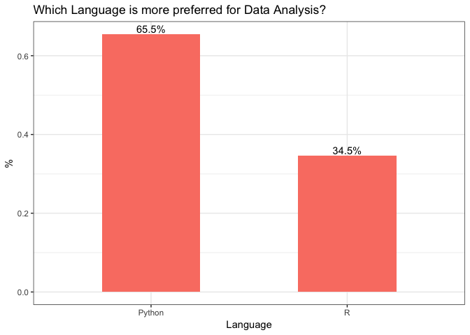
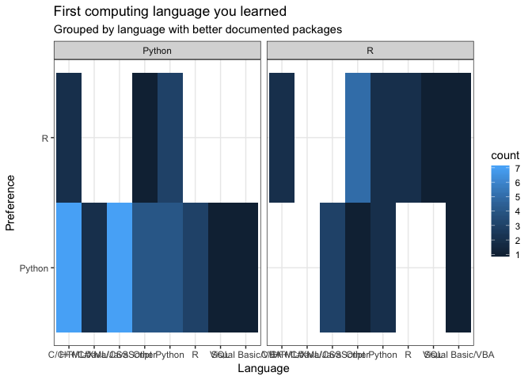
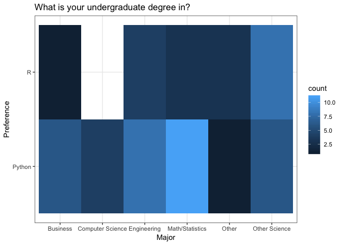
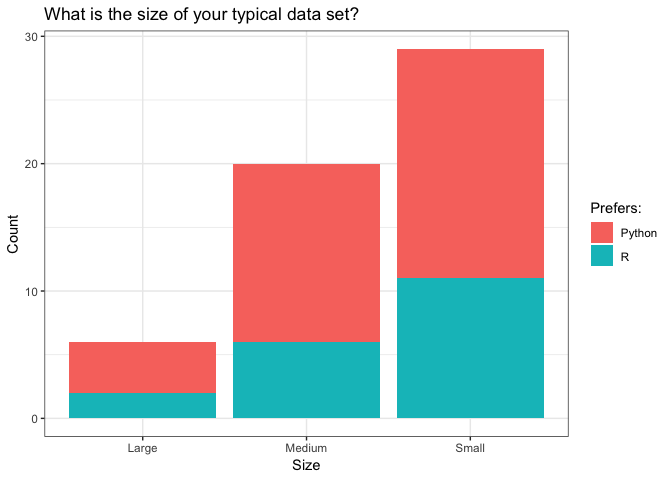
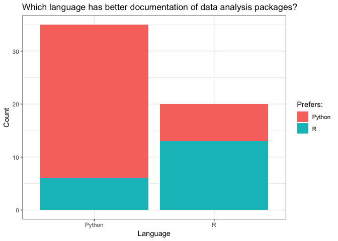

Python vs. R
================
April 13, 2019

### Analysis Question

Python and R are the two dominate Data Science programming languages, we
set out to determine how people’s background influenced their choice. In
particular we wanted to answer the following question:

> *Does the first programming language learned influence whether someone
> prefers Python or R when it comes to data analysis?*

### Potentinal Confounders

We identified the following potential confounding variables:

1.  What was your undergraduate degree in?
      - Someone’s educational background could have a large influence on
        their preferred programming language.
2.  What is the typical size of your analysis projects? Small(10Krows),
    Medium(10-1M rows), or large (1m+ rows)?
      - The size of a data analysis project might influence the language
        a person tends to use because of differences in speed and
        efficiency.
3.  Which language do you think has better documentation when it comes
    to its data analysis packages?
      - Having clear and concise documentation aids in the ease of
        wrangling data and decreases the learning curve of the language.
        The user might tend to prefer the language they believe has
        better documentation.

### Exploratory Data Analysis

##### Summary of survey results:

``` r
survey_summary <- summary(survey)
survey_summary %>% kable()
```

|  | Q1        | Q2                  | Q3                  | Q4        | Q5        |
| :- | :-------- | :------------------ | :------------------ | :-------- | :-------- |
|  | Python:36 | C/C++/C\# :11       | Business : 7        | Large : 6 | Python:35 |
|  | R :19     | Other :11           | Computer Science: 4 | Medium:20 | R :20     |
|  | NA        | Python :11          | Engineering :12     | Small :29 | NA        |
|  | NA        | Java/JavaScript :10 | Math/Statistics :14 | NA        | NA        |
|  | NA        | R : 5               | Other : 4           | NA        | NA        |
|  | NA        | Visual Basic/VBA: 3 | Other Science :14   | NA        | NA        |
|  | NA        | (Other) : 4         | NA                  | NA        | NA        |

<!-- -->

The majority of respondents (65%) preferred to use Python over R for a
data analysis task.

<!-- -->

Those that learned a `dev_lang` (either C/C++/C\#/Java/Javascript) seem
to prefer python over R most of the time. The majority of the survey
respondents were split between those that learned Python and
`web_dev_lang` languages first. This heatmap was faceted with which the
language majority of people believe have better documentation. This
seems to indicate that more people prefer the language they believe has
better documentation (in this case, Python).

<!-- -->

This plot seems to indicate that those with a Business, Math/Statistics/
or Computer Science backgrounds preferred Python while those with
Sciences/Other degrees preferred R over Python.

<!-- -->

The size of the data worked with for a data analysis task appears to
show no influence on the language a person prefers.

<!-- -->

It seems highly correlated that people prefer to choose the language
that they believe has better documentation. Over half of the respondents
had experience with small analysis projects.

### Analysis

##### Initial Analysis

``` r
log_reg <- glm(Q1 ~ ., family = "binomial", data = survey)
log_reg %>% tidy() %>% kable()
```

| term               |     estimate |    std.error |   statistic |   p.value |
| :----------------- | -----------: | -----------: | ----------: | --------: |
| (Intercept)        |  \-2.6202303 |    1.8482797 | \-1.4176590 | 0.1562903 |
| Q2Other            |    0.7482577 |    1.1141031 |   0.6716234 | 0.5018235 |
| Q2Python           |    1.1063489 |    0.9558456 |   1.1574556 | 0.2470863 |
| Q2R                |  \-0.0058721 |    1.6014063 | \-0.0036668 | 0.9970743 |
| Q2web\_dev\_lang   |  \-0.0108872 |    1.4941934 | \-0.0072864 | 0.9941864 |
| Q3Computer Science | \-14.8334536 | 1970.5572832 | \-0.0075275 | 0.9939939 |
| Q3Engineering      |    1.1019354 |    1.4159392 |   0.7782364 | 0.4364297 |
| Q3Math/Statistics  |  \-0.7112696 |    1.5121607 | \-0.4703664 | 0.6380933 |
| Q3Other            |    1.5945260 |    1.3997708 |   1.1391337 | 0.2546474 |
| Q4Medium           |  \-0.5085060 |    1.3053905 | \-0.3895432 | 0.6968743 |
| Q4Small            |    0.0002643 |    1.3585590 |   0.0001946 | 0.9998448 |
| Q5R                |    2.5108564 |    0.8839316 |   2.8405552 | 0.0045035 |

Our initial approach to analyzing the survey results was to just use a
logisitc regression with all the avaliable variables. However, from our
EDA we suspected that some of our identified confounding variables were
not going to be significant because there was not a lot of distinction
between preferred language and levels of those the confounding
variables. As a note, we reduce the number of categories for certain
variables because they contained very few sample data points. After
looking at the results of the logistic regression our assumptions were
confirmed. Everything besides “Which language has better package
documentation” was found to be insignifican at a 5% significance
level.

##### Feature Selection

``` r
log_reg1 <- glm(Q1 ~ Q2 + Q5 + Q3 + Q4, family = "binomial", data = survey)
anova(log_reg1, test="Chisq") %>% kable()
```

|      | Df |   Deviance | Resid. Df | Resid. Dev | Pr(\>Chi) |
| :--- | -: | ---------: | --------: | ---------: | --------: |
| NULL | NA |         NA |        54 |   70.90461 |        NA |
| Q2   |  4 |  5.0319744 |        50 |   65.87263 | 0.2840324 |
| Q5   |  1 | 11.0122134 |        49 |   54.86042 | 0.0009051 |
| Q3   |  4 |  7.2702077 |        45 |   47.59021 | 0.1222796 |
| Q4   |  2 |  0.3799394 |        43 |   47.21027 | 0.8269842 |

We deciced to then use a forward variable selection technique to
determine what to use in our final model. Evident in the table above it
appears the best model to use is `Q1 ~ Q2 + Q5`, even though \``Q1 ~ Q2`
is not significant on its own.

##### Final Model

``` r
log_reg2 <- glm(Q1 ~ Q2 + Q5, family = "binomial", data = survey)
log_reg2 %>% tidy() %>% kable()
```

| term             |    estimate | std.error |   statistic |   p.value |
| :--------------- | ----------: | --------: | ----------: | --------: |
| (Intercept)      | \-2.2057516 | 0.6886771 | \-3.2028822 | 0.0013606 |
| Q2Other          |   1.2605336 | 0.9247117 |   1.3631639 | 0.1728309 |
| Q2Python         |   1.2482450 | 0.9229448 |   1.3524590 | 0.1762285 |
| Q2R              |   0.8651467 | 1.2075281 |   0.7164609 | 0.4737068 |
| Q2web\_dev\_lang |   0.1381003 | 1.1228093 |   0.1229953 | 0.9021108 |
| Q5R              |   2.1355124 | 0.6817439 |   3.1324260 | 0.0017337 |

The first programming language that a person learned has a varying
impact impact on whether they prefer `R` or `Python`, for a data
analysis task. For example, if a person learned `Python` first, the
log-odds that they prefer `Python` over `R` increase by 1.248,
everything else held equal; similar interpretations follow for the other
options of first programming language. However, none of these
coefficents were found to be statistically significant at 5%, a
potential reason for this could be our limited sample size.

### Discussion of Survey

This survey’s results could have been much clearer, however our logistic
regression model classified the confounding variables to the best of its
abilities when given the survey data we recieved. In retrospect, for
this analysis to have a more clear answer in finding our confounding
variables, it should have been critical to have more than 50 responses.
The lack of responses made some of our visualizations have gaps which
made it difficult to have great EDA analysis.

Another aspect we would choose to improve our survey on would be to
reduce the number of the number of categories in the questions asked
because having multiple categories resulted in very small
stratifications (as we had a small sample size). Of the tasks we did
well was to use logistic regression and make use of the many categorical
variables we had in our survey responses. The model read that one of the
most confounding variable was whether the respondent believed a language
had good documentation with relation to which language they preferred,
no matter their history with either language.
